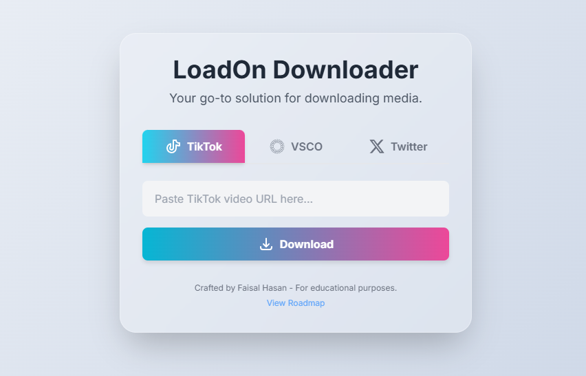

# LoadOn - Faisal's Personal Downloader

A **personal-use** web tool for downloading videos and images from popular platforms like **TikTok**, with planned support for **Twitter** and **VSCO**.
> ⚠**Disclaimer**: This tool is for **personal use only**. Please respect the terms of service of the respective platforms.


## Features
- **TikTok Downloader**  
  - Download videos **with** or **without watermark**.
  - Simple copy-paste URL input and one-click download.
 
- **Tab-based Interface**  
  - Switch easily between TikTok, Twitter, and VSCO tabs.
  
- **Responsive UI**  
  - Built with [Tailwind CSS](https://tailwindcss.com/) for a clean, modern design.
  
- **Dark Mode Support**  

## Usage
1. Clone the repository:
   ```bash
   git clone https://github.com/yourusername/personal-downloader.git
   cd personal-downloader

## Preview


## Tech Stack

- **HTML5** for structure  
- **Tailwind CSS** for styling  
- **JavaScript (Vanilla)** for functionality  
- External API: [TikWM](https://tikwm.com/) for TikTok downloads

## 📂 Project Structu
